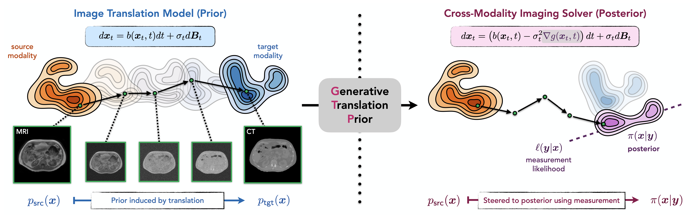

# Generative Translation Priors (GTP)

This repository contains code to reproduce the main results of [Generative Translation Priors: Bayesian Imaging with
Cross-Modality Image Translation](arxiv.org).



## Data, checkpoints, and environment set up

The environment used to run experiments can be installed with conda:

```bash
conda env create -f environment.yml
conda activate gtp
```

The other main dependency is [LEAP](https://github.com/LLNL/LEAP). After adding it as a submodule, it can be installed via `cd LEAP` followed by `pip install .`.

Preprocessed data and model checkpoints can be downloaded from [Google Drive](https://drive.google.com/drive/folders/1UhSqwGqte8CD5xTIND80Sdkia4RplemS?usp=drive_link). Original data are from the [SynthRad](https://synthrad2023.grand-challenge.org/) and [FDG-PET-CT-Lesions](https://fdat.uni-tuebingen.de/records/wf9fy-txq84) datasets under CC BY 4.0 licenses. Please arrange the files in the `data/` and `checkpoints/` folders as follows:

```text
data/
	mr_ct/
		ct/test.pt
		mr/test.pt
		mr_enc/test.pt 			  # unpaired GTP methods
	ct_pet/
		ct/test.pt
		pet/test.pt
checkpoints/
	unconditional_ct.ckpt         # DPS, DAPS, DDS
	mr_ct_translation.ckpt        # GTP methods for MR->CT
	mr_ct_unpaired.ckpt           # unpaired GTP methods
	ct_conditional_pet.ckpt       # PET-DDS
	ct_pet_translation.ckpt       # Prox-GTP for CT->PET
	sam.pth						  # unpaired GTP methods
```

## Image reconstruction with GTP methods and baselines

Run testing scripts from the repository root in the `gtp` conda environment. The device used for inference can be changed with the `--device` flag, for example `--device cuda:2`.

#### MR-to-CT

Standalone python scripts for the MR-CT experiments are available in `scripts/run_testing/mr_ct/`.

For example, to run Prox-GTP on SV-CT, one can run:

```bash
python scripts/run_testing/mr_ct/prox_gtp/test_sv_ct_prox_gtp.py --device cuda:0
```

Bash scripts are also available in `scripts/run_testing/mr_ct/bash_scripts/`, which will run both SV-CT and LA-CT experiments. Be sure to select the correct device before launching the script. For example, one can run:

```bash
bash scripts/run_testing/mr_ct/bash_scripts/test_prox_gtp.sh
```

#### CT-to-PET

Running the CT-PET reconstruction experiments is similar. Each script will run all three count levels (1e5, 5e5, and 1e6):

```bash
python scripts/run_testing/ct_pet/test_ct_pet_osem.py --device cuda:0
python scripts/run_testing/ct_pet/test_ct_pet_dds.py --device cuda:0
python scripts/run_testing/ct_pet/test_ct_pet_prox.py --device cuda:0
```

### Configs

Parameters are stored in [configs/testing/mr_ct.yml](configs/testing/mr_ct.yml)
and [configs/testing/pet.yml](configs/testing/pet.yml). Results are output to the
`results/ct_recon/` and `results/pet_recon/` directories by default.

After running experiments, the scripts `scripts/run_testing/mr_ct/get_tables.py` and `scripts/run_testing/ct_pet/get_tables.py` can be used to print tables with quantitative results.